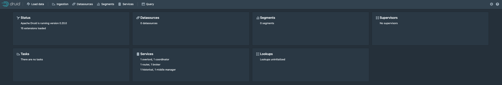

# Druid Docker

Creates fully configured and ready to use druid cluster, which uses `s3` as a deep storage and `mysql` as a metadata store.

## Running
You can start everything with this command:

> docker-compose up

All environment variables `${}` in docker compose file are substituted by values defined in `.env` file

By default it ships with `0.14.2-incubating` version. If you are willing to change the version use this command:

> docker-compose build --build-arg DRUID_VERSION="your-version"

This starts a Druid cluster including:
- **Zookeeper**
	- zoonavigator-web - Web interface for managing configuration stored whithin the ZooKeeper. Runs on `8000` port.
	- zoonavigator-api - Just a backend to serve zoonavigator-web requests. 
	- zookeeper - ZooKeeper itself. Runs on `2181` port.
- **S3**
	- s3-minio - An open source service to mimic S3 API and behavior. Runs on `9000` port.
- **Mysql**
	- mysql - Offical mysql image, 5.7.26 version is used. Runs on `3306` port.

---
**The most useful services:**
1. Druid Management UI - [http://localhost:8080](http://localhost:8080)
2. S3 Minio UI - [http://localhost:9000](http://localhost:9000)  
 access - `druid-s3-access`  
 secret -`druid-s3-secret`
3. Zookeeper Web UI - [http://localhost:8000](http://localhost:8000)  
connection string: `zookeeper:2181`
4. Mysql connection `jdbc:mysql://localhost:3306/druid`  
user name - `druid`  
password - `diurd` (root password - `1234`)
---


## Druid Cluster 

 * **coordinator** runs on `8081` port

The coordinator is primarily responsible for segment management and distribution. More specifically, the Druid Coordinator process communicates to Historical processes to load or drop segments based on configurations. The Druid Coordinator is responsible for loading new segments, dropping outdated segments, managing segment replication, and balancing segment load.

 * **broker** runs on `8082` port

The Broker is the process to route queries to if you want to run a distributed cluster. It understands the metadata published to ZooKeeper about what segments exist on what processes and routes queries such that they hit the right processes. This process also merges the result sets from all of the individual processes together. On start up, Historical processes announce themselves and the segments they are serving in Zookeeper.

* **historical** runs on `8083` port

Each Historical process maintains a constant connection to Zookeeper and watches a configurable set of Zookeeper paths for new segment information. Historical processes do not communicate directly with each other or with the Coordinator processes but instead rely on Zookeeper for coordination.

* **overlord** runs on `8090` port

The Overlord process is responsible for accepting tasks, coordinating task distribution, creating locks around tasks, and returning statuses to callers. Overlord can be configured to run in one of two modes - local or remote. In local mode Overlord is also responsible for creating Peons for executing tasks. When running the Overlord in local mode, all MiddleManager and Peon configurations must be provided as well. Our cluster is configured to run in remote mode.

* **middlemanager** runs on `8091` port

The MiddleManager process is a worker process that executes submitted tasks. Middle Managers forward tasks to Peons that run in separate JVMs. 

* **router** runs on `8080` port

In addition to query routing, the Router also runs the Druid Console, a management UI for datasources, segments, tasks, data processes (Historicals and MiddleManagers), and coordinator dynamic configuration. The user can also run SQL and native Druid queries within the console.

## Usage
Go to the [router](http://localhost:8080) page and you should see the following UI   


Go to the [s3-minio](http://localhost:9000) page and you should see the following UI (secrets could be found in running section)  


Go to the [zookeeper web](http://localhost:8000) page and you should see the following UI (secrets could be found in running section)  


#### Testing our cluster
Go to the [s3-minio](http://localhost:9000) and create a new bucket called `testbucket`, then upload `wikiticker-2015-09-12-sampled.json`.  
It can be found under data folder.  
Then submit the task, POST it to Druid's overlord (by default it runs on 8090)
```
curl -X 'POST' -H 'Content-Type:application/json' -d @your-repository-folder/wikipedia-index.json http://localhost:8090/druid/indexer/v1/task
```
To view the status of the ingestion task, go to the Druid Console Tasks section: [http://localhost:8080/unified-console.html#tasks](http://localhost:8080/unified-console.html#tasks). You can refresh the console periodically, and after the task is successful, you should see a "SUCCESS" status for the task under the Tasks view.  

After the ingestion task finishes, the data will be loaded by Historical processes and available for querying within a minute or two.
The segments files could be found in s3 storgae as well.


#### Quering Data
Now open sql tab: [http://localhost:8080/unified-console.html#sql](http://localhost:8080/unified-console.html#sql)

You are free to run any sql query, for example:
```
SELECT page, COUNT(*) AS Edits 
FROM wikipedia 
WHERE "__time" BETWEEN TIMESTAMP '2015-09-12 00:00:00' AND TIMESTAMP '2015-09-13 00:00:00' 
GROUP BY page 
ORDER BY Edits DESC LIMIT 10
```


Or any other query as demonstared in [this](http://druid.io/docs/latest/tutorials/tutorial-query.html) tutorial.

# Druid Configuration
## Environments variables
* **ZOOKEEPER_SERVER** - The zookeeper server address.
* **DRUID_SERVICE** - The name of the druid service [`broker`, `historical`, `coordinator`, `overlord`, `middleManager`, `router`]
* **DRUID_HOST** - The advertiser address that uses druid to expose the service on zookeeper.
* **DRUID_SERVICE_PORT** - The service port where bind the druid service.
* **DRUID_JVM_ARGS** - The JVM arguments to execute the druid services.
* **DRUID_PULL_EXTENSION** - The druid extension to download, this download is performed at running time. You need to pass the extension with whitespace: `extension1:extension1:version` `extension2:extension2:version`
* **AWS_REGION** - AWS region this is needed to work with AWS S3 extension.
* **S3_ACCESS_KEY** - Your S3 access key
* **S3_SECRET_KEY** - Your S3 secret key
* **S3_STORAGE_BUKCET** - S3 bucket for segmnts to be stored into, must exists
* **S3_STORAGE_BASE_KEY** - S3 segments path key
* **METADATA_STORAGE_HOST** - The name of the metadata storage [`mysql`, `postgresql`, `derby`]
* **METADATA_STORAGE_PORT** - The port metadata storage is listening on
* **METADATA_STORAGE_USER** - The user name to connect to the metadata storage
* **METADATA_STORAGE_PASSWORD** - The password to connect to the metadata storage

# Hadoop Integration
* Configuring `hadoop-client`  

In order to enable Hadoop indexing `hadoop-client` should be properly configured.   
To configure client Hadoop configuration files (e.g. `core-site.xml`, `yarn-site.xml`, etc) should exist on the Druid's classpath.  
Just place them under `~/drud/conf/_common/hadoop_xml/` folder and `druid-start.sh` script will add them to the Druid’s classpath.   
* Changing Hadoop version  

Changing Hadoop version is as simple as setting `HADOOP_VERSION` variable.  
By default it is taken from `common_env_config` file, e.g.
```
HADOOP_VERSION=2.9.2
```

* Loading additional extension

Any additional extensions could be loaded by modifying `DRUID_HADOOP_EXTENIONS` variable. 
E.g. Adding aws-s3 supprot:
```
DRUID_HADOOP_EXTENIONS=org.apache.hadoop:hadoop-aws
```

* Configuring indexing service which is part of the `middlemanager`

Change `druid.indexer.task.defaultHadoopCoordinates` property in the `~/middleManager/runtime.properties_env` file
E.g.
```
druid.indexer.task.defaultHadoopCoordinates=["org.apache.hadoop:hadoop-client:$HADOOP_VERSION","org.apache.hadoop:hadoop-aws:$HADOOP_VERSION"]
```  
* Using Amazon's `S3` as a deep storage isntead of `minio`  

Comment the following properties `~/druid/_common/common.runtime.properties_env` file:
```
druid.s3.enablePathStyleAccess=true
druid.s3.endpoint.url=http://s3-minio:9000
druid.s3.endpoint.signingRegion=us-east-1
```
And don't foget to modify these variables:
`AWS_REGION`  
`S3_STORAGE_BUKCET`  
`S3_STORAGE_BASE_KEY`  
`S3_ACCESS_KEY`  
`S3_SECRET_KEY`  

# Run each service separately
### Mysql
* build an image
```
docker build -t druid-mysql-image .
```
* run as a service
```
docker run -dit --name mysql -p 3306:3306 --network druid-net --env-file ../.env druid-mysql-image
```
### Minio
* run as a service
```
docker run -dit --name s3-minio -p 9000:9000 --network druid-net -e MINIO_ACCESS_KEY=druid-s3-access -e MINIO_SECRET_KEY=druid-s3-secret --env-file .env minio/minio:latest server /data 
```
### Zookeeper
* run as a service
```
docker run -dit --name zookeeper -p 2181:2181 --network druid-net -e ZOO_MY_ID=1 zookeeper:latest
```
### Druid
* build an image
```
docker build -t druid-base-image .
```
### Coordinator
* run as a service
```
docker run -dit --name coordinator -p 8080:8081 --network druid-net \
-e DRUID_SERVICE=coordinator  \
-e "DRUID_JVM_ARGS=-server -Xms256m -Xmx256m -Duser.timezone=UTC -Dfile.encoding=UTF-8 -Djava.util.logging.manager=org.apache.logging.log4j.jul.LogManager" \
-e S3_ACCESS_KEY=druid-s3-access \
-e S3_SECRET_KEY=druid-s3-secret \
-e METADATA_STORAGE_USER=druid \
-e METADATA_STORAGE_PASSWORD=diurd \
--env-file common_env_config druid-base-image
```
### Broker
* run as a service
```
docker run -dit --name broker -p 8383:8082 --network druid-net \
-e DRUID_SERVICE=broker  \
-e "DRUID_JVM_ARGS=-server -Xms3g -Xmx3g -Duser.timezone=UTC -Dfile.encoding=UTF-8 -Djava.util.logging.manager=org.apache.logging.log4j.jul.LogManager -XX:NewSize=512m -XX:MaxNewSize=512m -XX:MaxDirectMemorySize=3g -XX:+UseG1GC -XX:+PrintGCDetails -XX:+PrintGCTimeStamps -Dcom.sun.management.jmxremote.port=17071 -Dcom.sun.management.jmxremote.authenticate=false -Dcom.sun.management.jmxremote.ssl=false" \
-e S3_ACCESS_KEY=druid-s3-access \
-e S3_SECRET_KEY=druid-s3-secret \
-e METADATA_STORAGE_USER=druid \
-e METADATA_STORAGE_PASSWORD=diurd \
--env-file common_env_config druid-base-image
```
### Historical
* run as a service
```
docker run -dit --name historical -p 8083:8083 --network druid-net \
-e DRUID_SERVICE=historical  \
-e "DRUID_JVM_ARGS=-server -Xms2g -Xmx2g -XX:MaxDirectMemorySize=3g -Duser.timezone=UTC -Dfile.encoding=UTF-8 -Djava.util.logging.manager=org.apache.logging.log4j.jul.LogManager -XX:NewSize=1g -XX:MaxNewSize=1g -XX:+UseConcMarkSweepGC -XX:+PrintGCDetails -XX:+PrintGCTimeStamps" \
-e S3_ACCESS_KEY=druid-s3-access \
-e S3_SECRET_KEY=druid-s3-secret \
-e METADATA_STORAGE_USER=druid \
-e METADATA_STORAGE_PASSWORD=diurd \
--env-file common_env_config druid-base-image
```
### Overlord
* run as a service
```
docker run -dit --name overlord -p 8082:8090 --network druid-net \
-e DRUID_SERVICE=overlord  \
-e "DRUID_JVM_ARGS=-server -Xms256m -Xmx256m -Duser.timezone=UTC -Dfile.encoding=UTF-8 -Djava.util.logging.manager=org.apache.logging.log4j.jul.LogManager" \
-e S3_ACCESS_KEY=druid-s3-access \
-e S3_SECRET_KEY=druid-s3-secret \
-e METADATA_STORAGE_USER=druid \
-e METADATA_STORAGE_PASSWORD=diurd \
--env-file common_env_config druid-base-image
```
### Middlemanager
* run as a service
```
docker run -dit --name middlemanager -p 8091:8091 --network druid-net \
-e DRUID_SERVICE=middleManager  \
-e "DRUID_JVM_ARGS=-server -Xms256m -Xmx256m -Duser.timezone=UTC -Dfile.encoding=UTF-8 -Djava.util.logging.manager=org.apache.logging.log4j.jul.LogManager" \
-e S3_ACCESS_KEY=druid-s3-access \
-e S3_SECRET_KEY=druid-s3-secret \
-e METADATA_STORAGE_USER=druid \
-e METADATA_STORAGE_PASSWORD=diurd \
--env-file common_env_config druid-base-image
```
### Router
* run as a service
```
docker run -dit --name router -p 8081:8080 --network druid-net \
-e DRUID_SERVICE=router  \
-e "DRUID_JVM_ARGS=-server -Xms256m -Xmx256m -Duser.timezone=UTC -Dfile.encoding=UTF-8 -Djava.util.logging.manager=org.apache.logging.log4j.jul.LogManager" \
-e S3_ACCESS_KEY=druid-s3-access \
-e S3_SECRET_KEY=druid-s3-secret \
-e METADATA_STORAGE_USER=druid \
-e METADATA_STORAGE_PASSWORD=diurd \
--env-file common_env_config druid-base-image
```
